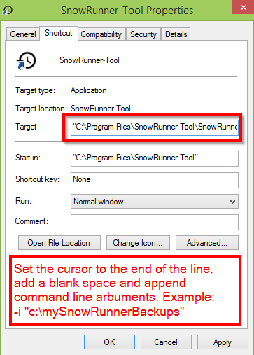

# SnowRunner-Tool

The game *SnowRunner* is a pain! Don´t play it. But if you do, you will sooner or later get stuck with your truck in the deepest mud, lose all your payload and your best trailer. That is the very moment, when this small tool comes into the game.

So, if you feel that restoring a saved game would sometimes be nice to have, here is the good news: The game creates backups from time to time, and it´s easy to restore them.

The *SnowRunner-Tool* does nothing that you could not do in a manual way, but it makes it safe and easy and it´s looking nice.

**Use this software with caution! I have tested a lot, but only on my own machine. I recommend to make manual backups until you are sure that everything works as expected.**

## Features

*SnowRunner-Tool* lets you
- create backups of the current game state,
- restore a saved game from the game´s backup repository, a backup made with this tool or a directory containing 3rd party backups as Zip files and
- cheat the amount of money you have in your pocket.


## Installation

1. Microsoft .NET Framework 4.7.2. **must be installed** for *SnowRunner-Tool* to start! It should deliver with Windows Updates, but it is not a mandatory update. You can download .NET Framework 4.7.2 [here](http://go.microsoft.com/fwlink/?linkid=863262).
2. Download the latest version from [Github Releases](https://github.com/elpatron68/SnowRunner-Tool/releases) or [mod.io](https://snowrunner.mod.io/snowrunner-tool/#15370) and unzip the files to a location of your choice. **Never download the file from any other website**!
3. Start `SnowRunner-Tool.exe` or create a desktop shortcut. Windows will warn you about using suspicious software as this program is not signed with a valid certificate. You have to accept this at the first start.


## Uninstall

*SnowRunner-Tool* does not create any further files or registry settings. Just delete the folder you unzipped it to.

## Usage

After the start, *SnowRunner-Tool* reads all backup files created by the game, by itself or by a third party backup script and lists them with their time stamps. Right click on a row to restore the selected backup. Before restoring a backup to your save game slot, another backup of the current game state will be made.

You can manually create a backup of the current game state by clicking on *Backup current save game*.

Set the amount of money you´d like to have by entering a value and clicking the *Set money* button. Before changing the money in your save game file, another fresh backup will be created.

Activate *Send log* if you wish to help the developer to find bugs and add new features. All log messages are sent to a private server and **don´t contain** any personal data like your IP address. *Remote logging is disabled by default*. Remote logging can also be enabled with the command line argument `-l` (see *Advanced*). If you need help from the developer, open an issue at [Github](https://github.com/elpatron68/SnowRunner-Tool/issues), describe the problem and post your Support ID shown in the main window.

### Notes

* After restoring a save game from a backup or after altering the money, the *Epic Launcher* detects locally changed files. You are asked if you want to upload local files into the cloud or download cloud files to your local disk. Choose *Upload local files*.
* If *SnowRunner-Tool* does not start after double clicking, install Microsoft .NET Framework 4.7.2 (see *Installation* above).

## Advanced

*SnowRunner-Tool* has a few command line arguments. Just create a desktop shortcut for `SnowRunner-Tool.exe`, edit the properties and append the command line parameters to the field *Target* (see Screenshot).



### Command line arguments

`-i <Path-to-3rd-Party-Backup>`

Imports 3rd party backups. The directory must contain backups from the save game directory as **Zip files**. You can use a *Powershell* [script](https://forums.focus-home.com/user/grimdanfango) to create backups in regular intervals while you are playing the game. *SnowRunner-Tool* lists these backups and lets you restore them with one click.

`-l`

Enables remote logging and makes the dev happy.

## Useful links

- User [grimdanfango](https://forums.focus-home.com/user/grimdanfango) made a Powershell Script that creates Backups in a configurable interval while the game is running. Instructions can be found <a href="https://forums.focus-home.com/topic/47932/backup-save-game-script" target="_blank">here</a>.
- Thread on <a href="https://www.reddit.com/r/snowrunner/comments/gdf1jt/pc_snowrunner_backs_up_your_saved_games_heres_how/" target="_blank">Reddit</a> discussing the games´s backups and how to restore them manually.
- This tool on [mod.io](https://snowrunner.mod.io/snowrunner-tool/#15370)

## License


```text
DO WHAT THE FUCK YOU WANT TO PUBLIC LICENSE 
Version 2, December 2004 

 Copyright (C) 2004 Sam Hocevar <sam@hocevar.net> 

 Everyone is permitted to copy and distribute verbatim or modified 
 copies of this license document, and changing it is allowed as long 
 as the name is changed. 

            DO WHAT THE FUCK YOU WANT TO PUBLIC LICENSE 
   TERMS AND CONDITIONS FOR COPYING, DISTRIBUTION AND MODIFICATION 

  0. You just DO WHAT THE FUCK YOU WANT TO.
 ```
 
 ## 3rd party Licenses
 
 - Icons from https://material.io/ ([Apache License](https://github.com/google/material-design-icons/blob/master/LICENSE))
 - WPF theme from https://mahapps.com/ ([MIT License](https://github.com/MahApps/MahApps.Metro/blob/develop/LICENSE))
 - [Command Line Parser Library for CLR and NetStandard](https://github.com/commandlineparser/commandline) (MIT License)
 