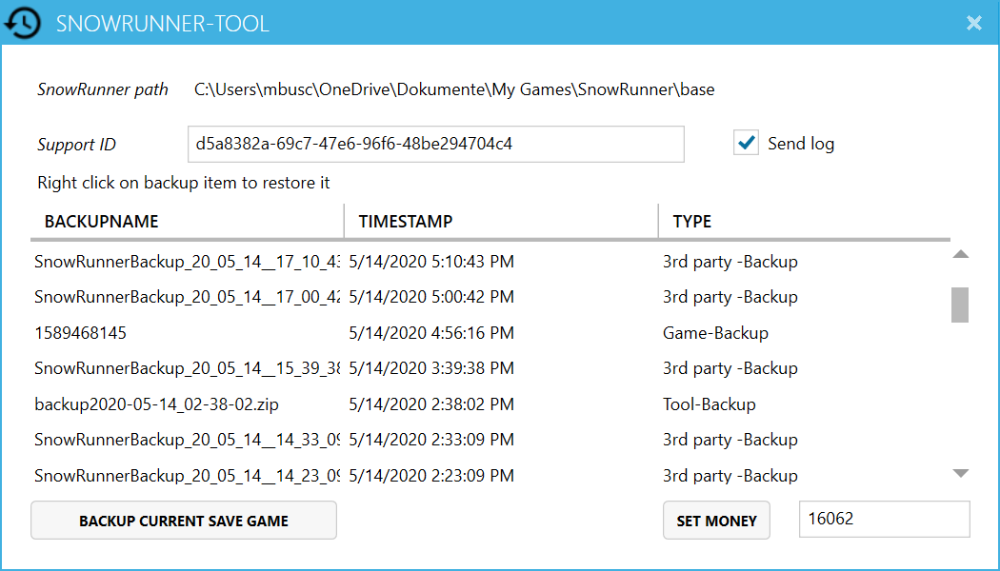
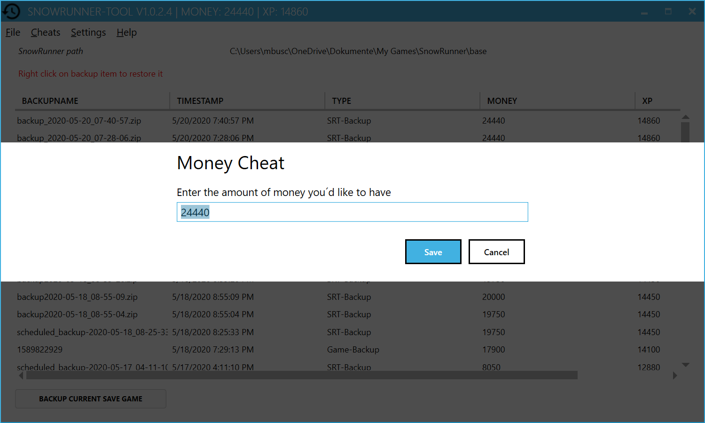
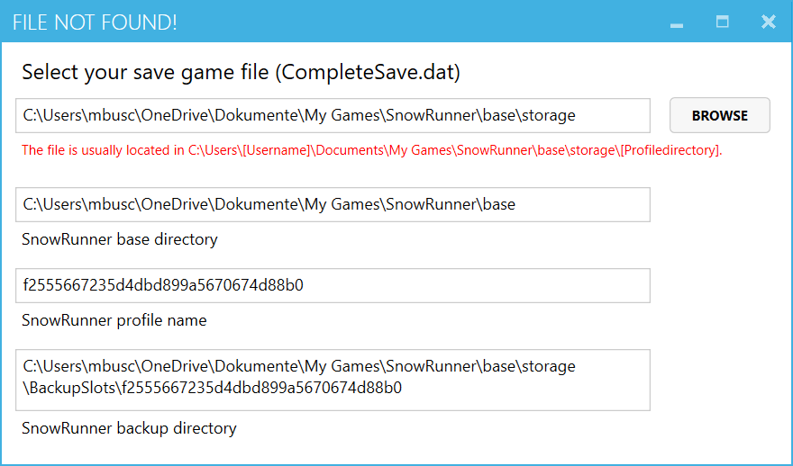
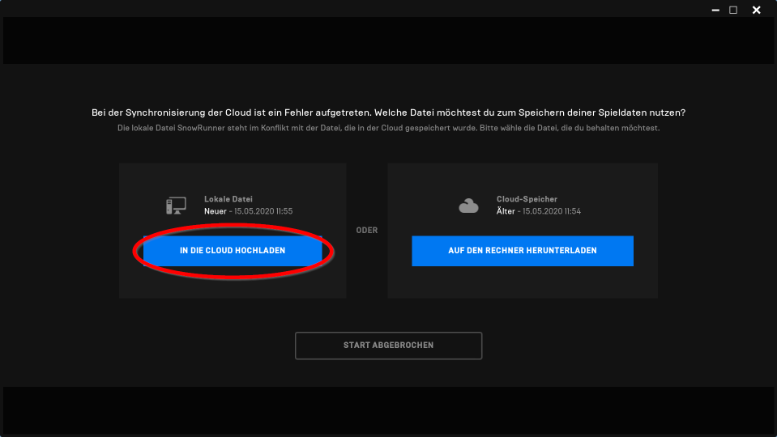

# SnowRunner-Tool

The game *SnowRunner* is a pain! Don´t play it. But if you do, you will sooner or later get stuck with your truck 
in the deepest mud, lose all your payload and your best trailer. That is the very moment, when this small tool 
comes into the game.

So, if you feel that restoring a saved game would sometimes be nice to have, here is the good news: The game 
creates backups from time to time, and it´s easy to restore them.

The *SnowRunner-Tool* does nothing that you could not do in a manual way, but it makes it safe and easy and it´s 
looking nice.

In addition, this tool lets you change (cheat) the money and experience points of the current game state. So, 
if you feel, you are broke, don´t hesitate to rob the bank!

**Use this software with caution! I have tested a lot, but only on my own machine. I recommend to make manual 
backups until you are sure that everything works as expected.**

## Features

*SnowRunner-Tool* Features in details

- Create backups of the current game state and list them in a fancy style
- Hotkey `F2` for instant in-game-backups without leaving the game
- Automatically create backups afer the game itself saves it´s status
- Restore a saved game from the game´s backup repository or a backup made with this tool (single save game slot 
or all slots)
- Delete backups from the list and your storage
- Rename backup files from the UI
- Cheat the amount of money you have in your pocket
- Cheat your experience points (XP)
- Create backups of the file `initial.pak` (which has to be changed for some mods)
- Restore former saved `initial.pak` file



## Installation

### Installation With Setup.exe

1. Download the latest `SRT_setup.zip` from [Github Releases](https://github.com/elpatron68/SnowRunner-Tool/releases) 
   or [mod.io](https://snowrunner.mod.io/snowrunner-tool/#15370).
2. Unzip the file and install *SnowRunner-Tool* by starting `SRT_setup.exe`. The setup will install the required 
   Microsoft .NET Framework 4.7.2 if it is not found on your system.

### Manual Installation From Zip File

1. Microsoft .NET Framework 4.7.2. **must be installed** for *SnowRunner-Tool* to start! It should deliver with Windows 
   Updates, but it is not a mandatory update. You can manually download .NET Framework 4.7.2 
   [here](http://go.microsoft.com/fwlink/?linkid=863262) or update your Windows - see optional updates.
2. Download the latest `SRT-portable.zip` from [Github Releases](https://github.com/elpatron68/SnowRunner-Tool/releases) 
   and unzip the files to a location of your choice. **Never download the file from any other website**!
3. Start `SnowRunner-Tool.exe` or create a desktop shortcut. Windows will warn you about using suspicious software as 
   this program is not signed with a valid certificate. You have to accept this at the first start.

## Uninstall

### Zip File Version

*SnowRunner-Tool* does not create any further files or registry settings. Just delete the folder you unzipped it to.

### Setup Version

Uninstall *SnowRunner-Tool* with the Windows *Programs and Functions* control.

## Usage

After the start, *SnowRunner-Tool* reads all backup files created by the game or by itself and lists them with their 
time stamps and further information as the amount of money and XP. *Right click* on a row to restore or delete the 
selected backup. Before restoring anything, another backup of the current game state will be made.

### Save game backup

1. Manually create a backup of the current game state by clicking on *Backup save game* in the *File* menu or clicking 
   the button *Backup current save game*.   
2. Hit the function key `F2` for an instant backup while you play the game without leaving the game.
3. Let the tool create *regular backups* in the background while playing the game.

#### Notes

- **Backups can usually be created while the game is running**. If you have to master a risky maneuver, just 
  switch to your *SnowRunner-Tool* and make a backup before you fail. Or even easier: Let the tool run in the backgroud 
  and use the instant-hotkey-backup (`F2`).
- The `F2` backup function only works while the game is running!
- Activate *regular backups* in the settings menu to automatically let the tool create backups in the background.

### PAK backup

Create a backup of your `initial.pak` file before making changes to it! Open the *File* menu and select 
*Backup INITIAL.PAK*. The backup will be listed as *PAK-Backup* and can be restored as any other backup by right clicking 
on it.

**This feature is experimental, handle with care!**

### Menu Cheats

Set the amount of money or experience points you´d like to have by opening the *Cheats* menu. Before changing the money 
or XP points in your save game file, another fresh backup will be made.



## Menu Settings

In the *Settings* menu, you can enter a couple paths this tool needs to operate. Also,  usage reporting and remote logging 
can en- and disabled. A check mark will be displayed if an option is enabled.

### Save Game Path

*SnowRunner-Tool* tries to find your save game path automagically at the first start (which is not always a trivial task). 
If this fails, the *Set save game path* dialog will open. If you like to change this setting at a later time, open the menu 
*Settings* -  *Set save game path*.



Click *Browse*, navigate to the file `CompleteSave.dat` and open it.

Usually, the file is located under your documents folder -> my games -> snowrunner -> base -> storage -> 
(profile directory, long name of random characters).

Example:
```
C:\Users\johndoe\Documents\My Games\SnowRunner\base\storage\f2555667235d4dbd899a5670674d88b0
```

All other path fields in the dialog are read only and will be filled by the app.

### Autobackup

The *Autobackup* option automatically creates backups while the game is running. The function ist triggered 
by the game itself: After the game saved it´s state (when a "saving" message is displayed to the player), 
*SnowRunner-Tool* creates a backup of the files. You can disable this function or set it to 
2, 5 or 10 "minutes" - or exact: *cycles*. The actual time intervals depend on the intervals, the game saves 
it´s state. 

They vary from ~ 20 seconds to ~ 60 seconds. So, if you activate an interval of 5 minutes, the game state is 
backuped every fifth time the game itself saves, which usually results in one backup per less than 5 minutes. 
You have to reload the backup list (*File* - *Reload backup table*) or restart *SnowRunner-Tool* to see these 
backups appear in the list.

### Logging

The App creates log files in the directory `%LOCALAPPDATA%\SRT`.

If you need help from the developer, open an issue at [Github](https://github.com/elpatron68/SnowRunner-Tool/issues), 
describe the problem and attach the log file.

## Menu Help

Pretty self-explanatory:

* Link to this Readme (online)
* Check for new version
* Copy support-ID
* Project web links
* License
* About


## Notes

* If *SnowRunner-Tool* does not start after double clicking, install Microsoft .NET Framework 4.7.2 
  (see *Installation* above).
* After you have restored a saved game from a backup or after altering money or XP, the *Epic Launcher* detects 
  locally changed files at the next game start. You are asked if you want to upload local files into the cloud or 
  download cloud files to your local disk. Choose *Upload local files*.

* It is not possible to change money or XP while the game is running.

## Advanced, Troubleshooting

### Save Game Path Not Found

If *SnowRunner-Tool* cannot find your game profile directory, you are asked to enter the path to your save 
game file *CompleteSave.dat*.


Select the file *CompleteSave.dat* in that folder, click *Open* and close the *FILE NOT FOUND!* dialog.

## Useful links

- User [grimdanfango](https://forums.focus-home.com/user/grimdanfango) made a Powershell Script that creates 
  Backups in a configurable interval while the game is running. Instructions can be found 
  <a href="https://forums.focus-home.com/topic/47932/backup-save-game-script" target="_blank">here</a>.
- Thread on <a href="https://www.reddit.com/r/snowrunner/comments/gdf1jt/pc_snowrunner_backs_up_your_saved_games_heres_how/" target="_blank">Reddit</a> 
  discussing the games´s backups and how to restore them manually.
- This tool on [Github](https://github.com/elpatron68/SnowRunner-Tool)
- This tool on [mod.io](https://snowrunner.mod.io/snowrunner-tool/#15370)

## License


```text
DO WHAT THE FUCK YOU WANT TO PUBLIC LICENSE 
Version 2, December 2004 

 Copyright (C) 2004 Sam Hocevar <sam@hocevar.net> 

 Everyone is permitted to copy and distribute verbatim or modified 
 copies of this license document, and changing it is allowed as long 
 as the name is changed. 

            DO WHAT THE FUCK YOU WANT TO PUBLIC LICENSE 
   TERMS AND CONDITIONS FOR COPYING, DISTRIBUTION AND MODIFICATION 

  0. You just DO WHAT THE FUCK YOU WANT TO.
 ```
 
 ## Third party Licenses
 
 - Icons from https://material.io/ ([Apache License](https://github.com/google/material-design-icons/blob/master/LICENSE))
 - WPF theme from https://mahapps.com/ ([MIT License](https://github.com/MahApps/MahApps.Metro/blob/develop/LICENSE))
 