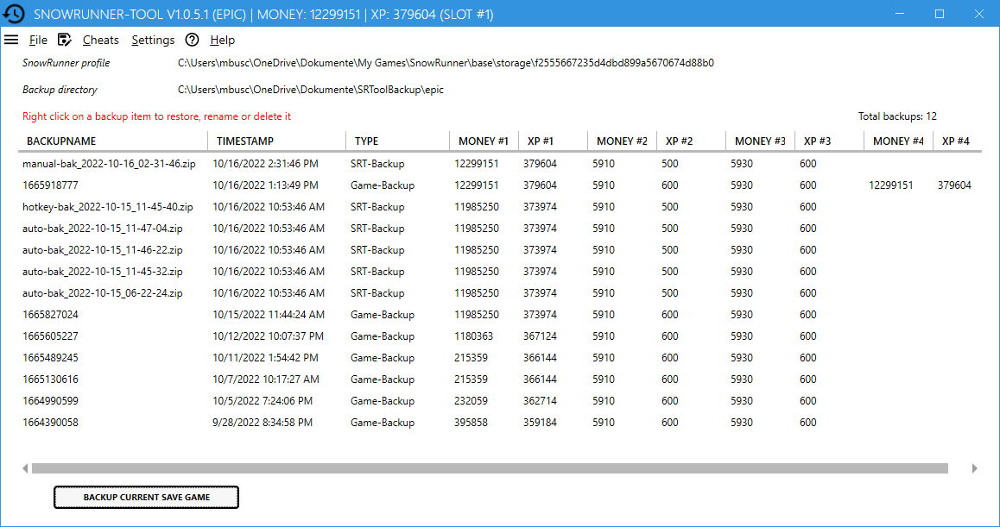

# SnowRunner-Tool

The game *SnowRunner* is a pain! Don´t play it. But if you do, you will sooner or later get stuck with your truck in the deepest mud, lose all your payload and your best trailer. That is the very moment, when this small tool comes into the game.

So, if you feel that restoring a saved game would sometimes be nice to have, here is the good news: The game creates backups from time to time, and it´s easy to restore them.

The *SnowRunner-Tool* does nothing that you could not do in a manual way, but it makes it safe and easy and it´s looking nice.

## Features

*SnowRunner-Tool* lets you
- restore a saved game from the game´s backup repository,
- create backups of the current games sate and
- cheats the amount of money you have in your pocket.



# Installation

Download the latest version from Releases and unzip the files to a location of your choice.

Start `SnowRunner-Tool.exe` or create a desktop shortcut. Windows will warn you about using suspicious software as this program is not signed with a valid certificate. You have to accept this at the first start.

## Uninstall

*SnowRunner-Tool* does not create any further files or registry settings. Just delete the folder you unzipped it to.

## Usage

After the start, *SnowRunner-Tool* reads all backup files created by the game and by itself and lists them with their time stamps. Right click on a row to restore the selected backup. Before restoring a backup to the save game slot, another backup of the current game state will be made.

You can manually create a backup of the current game state by clicking on *Backup current save game*.

Set the amount of money you´d like to have by entering a value and clicking the *Set money* button. Before changing the money in your save game, another backup will be created.

After restoring a save game from a backup or after altering the money, the Epic Launcher detects locally changed files. You are asked if you want to upload local files into the cloud or download cloud files to your local disk. Choose *Upload local files*.

## Useful links

- User [grimdanfango](https://forums.focus-home.com/user/grimdanfango) made a Powershell Script that creates Backups in a configurable interval while the game is running. Instructions can be found <a href="https://forums.focus-home.com/topic/47932/backup-save-game-script" target="_blank">here</a>.
- Thread on <a href="https://www.reddit.com/r/snowrunner/comments/gdf1jt/pc_snowrunner_backs_up_your_saved_games_heres_how/" target="_blank">Reddit</a> discussing the games´s backups and how to restore them manually.

## License


```text
DO WHAT THE FUCK YOU WANT TO PUBLIC LICENSE 
Version 2, December 2004 

 Copyright (C) 2004 Sam Hocevar <sam@hocevar.net> 

 Everyone is permitted to copy and distribute verbatim or modified 
 copies of this license document, and changing it is allowed as long 
 as the name is changed. 

            DO WHAT THE FUCK YOU WANT TO PUBLIC LICENSE 
   TERMS AND CONDITIONS FOR COPYING, DISTRIBUTION AND MODIFICATION 

  0. You just DO WHAT THE FUCK YOU WANT TO.
 ```
 
 ## 3rd party Licenses
 
 - Icons from https://material.io/ ([Apache License](https://github.com/google/material-design-icons/blob/master/LICENSE))
 - WPF theme from https://mahapps.com/ ([MIT License](https://github.com/MahApps/MahApps.Metro/blob/develop/LICENSE))
 
 